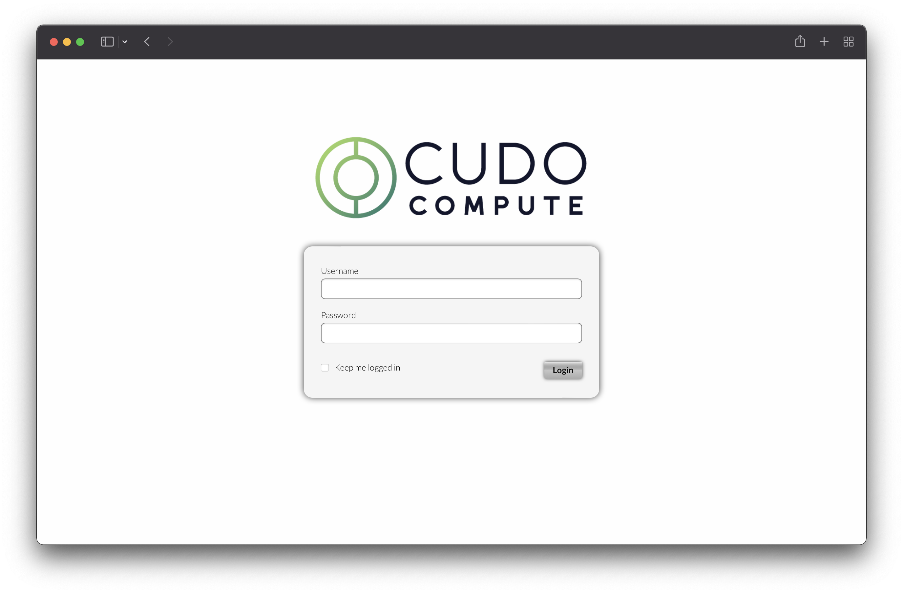
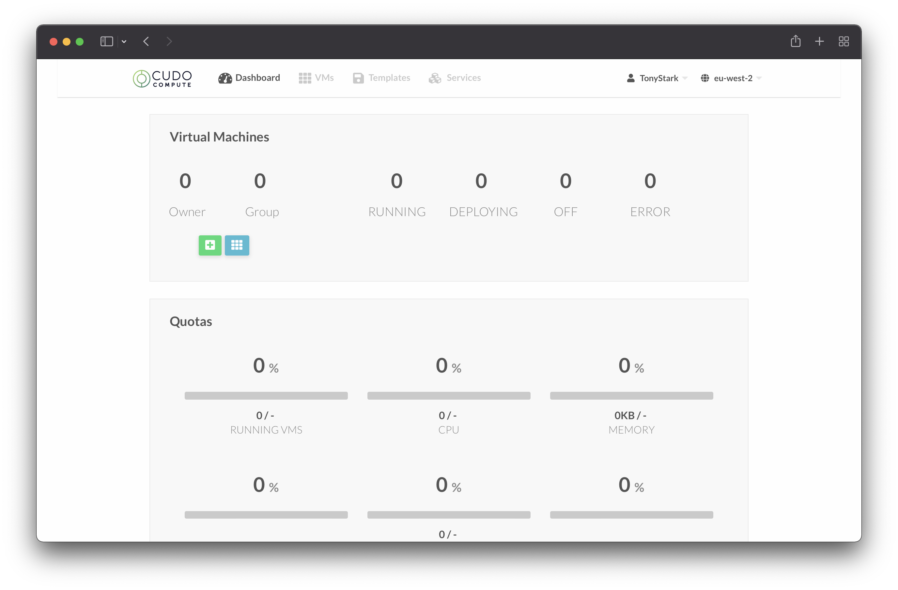
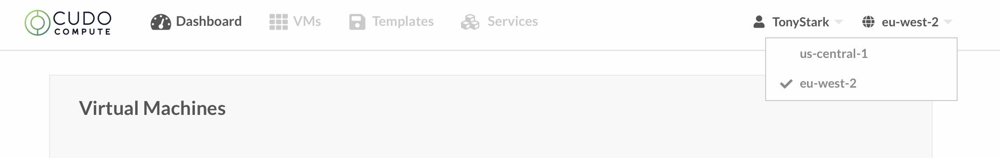
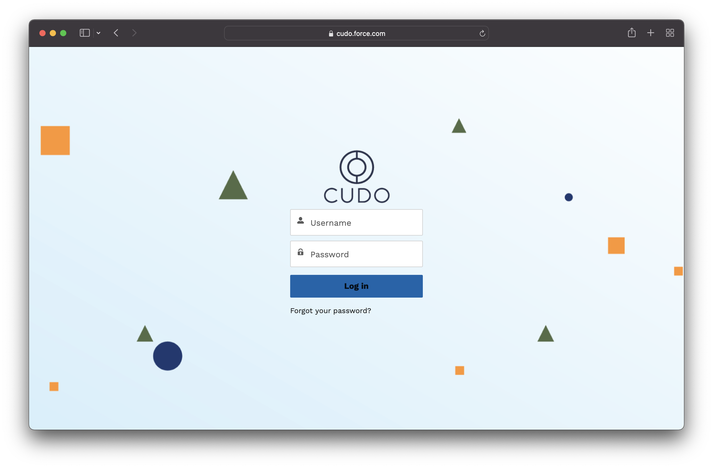

# Introduction

## Getting Started

### Logging In

You should have already been provided credentials to login. If not, please reach out to your Account Manager. Simply browse to the following URL to access Cudo Compute

[Cudo Compute](https://alpha.cudocompute.com)

You will see a login screen like the below, and login using the credentials that you have been provided.

### Dashboard

Once you have logged in, you are presented the main dashboard that will summarize the workloads that are currently running.

If you are logging in for the first time, it’s unlikely there will be anything here just yet - but once you start provisioning your servers you will see this populate.

### Zones

When using Cudo Compute, you will have access to multiple locations to build and manage your resources. By default, you will be connected to the EU West location, however you can navigate to other locations in the top right hand corner.

Further locations may be added during the testing phase based on demand.

## Support

If you require assistance while using the Cudo Compute platform, you can login to the Support Portal: [https://cudo.force.com/](https://cudo.force.com/). 

You should have received access to this portal when you gained access to Cudo Compute, however if you do not, please reach out to the Services team via email: [services@cudoventures.com](mailto:services@cudoventures.com)

