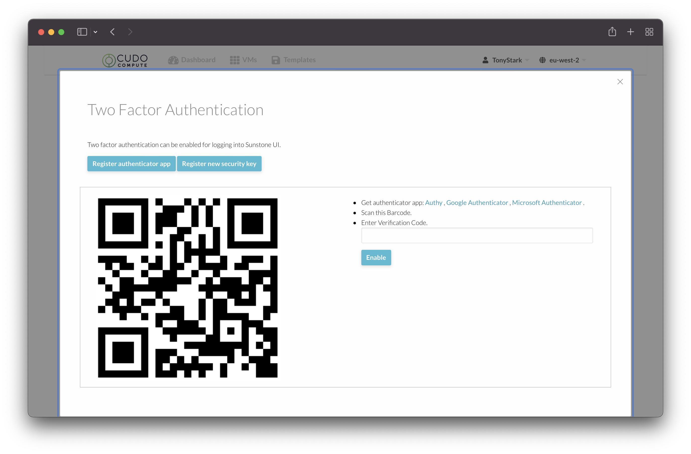
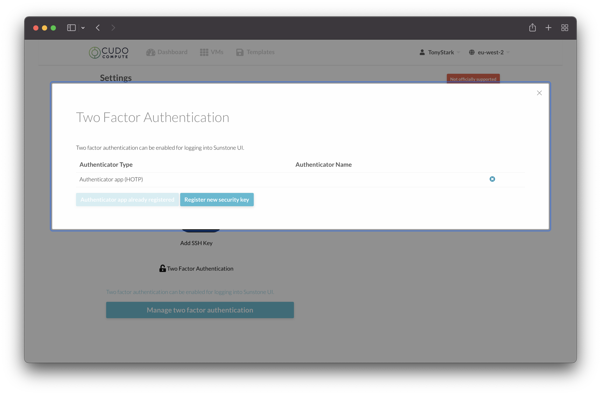

# Administration

You can access the Settings / Administration section of Cudo Compute by clicking on your username in the top right hand corner and choosing "Settings".

## Change Language

You can change the language of the interface on the Cudo Compute platform. Simply select the "Change Language" option within the Settings page. You can choose many available languages from the dropdown and click "Update Language".

## Change Password

To update your password that you use to log in to the Cudo Compute platform, select the "Change Password" option within the Settings page. Type in your new password twice and click "Update Password".

## Add SSH Key

Before you build any virtual machines, its strongly recommended to add your public SSH key to Cudo Compute, so you can log into any virtual machines without requiring a password

If you are unsure how to create a SSH key, please refer to the below documentation:

[Windows with PuTTY](https://www.ssh.com/academy/ssh/putty/windows/puttygen)

[Linux / OSX](https://www.ssh.com/academy/ssh/keygen)

## Two Factor Authentication

If you wish to enable Two Factor Authentication for security purposes, this is possible by using a TOTP/HOTP (Time-based One-Time Password/HMAC-based One-Time Password) app such as Google Authenticator or Authy.

Click on "Two Factor Authentication" within the Settings screen and then click "Manage two factor authentication".

Click "Register authenticator app" and you will be shown a QR code.

Scan the QR code with your authenticator application and enter the verification code into the Cudo Compute interface. Click "Enable".

You will now be required to enter a verification code each time you log into the Cudo Compute interface.

### Removing an Authenticator

If you decide you no longer want two factor authentication enabled, you can go back into the Two factor settings screen and click the 'x' in the row that your authenticator app is registered.

