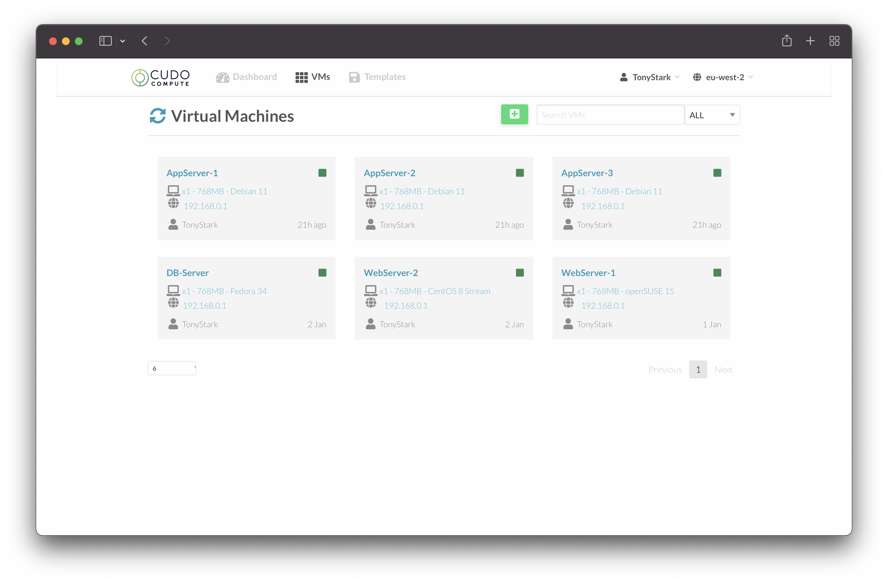

# Building VMs

To build a VM in Cudo Compute, simply click on the "VMs" tab at the top of the page and then on the green "+" button.

This will open a list of currently available [templates](templates.md#available-templates). Select the template of your choice as the base for your VM.

You can now enter your preferred name for the VM and choose the CPU, RAM and size of the initial disk by using the appropriate sliders.

Scroll down the page and enter your choice of initial root password.

::: tip NOTE
It is strongly recommended that you add an [SSH Key](administration.md#add-ssh-key) to your user account. When a [SSH Key](administration.md#add-ssh-key) is added, this will be automatically added to VMs on creation, rather than needing to use a password.
:::

At this point, also select the location that you wish to build your VM in. Please see below for a list of all locations we currently have:

| Datastore Name | Supplier | Location |
|--- |--- |--- |
| uk-blocz01 | Blocz IO | Cambridge, UK |

Once you are happy with your selection, scroll back to the top of the page and click the green "Create" button. You will be taken back to the [VM List](managing-vms.md#view-your-vms) - simply click on your newly created VM to start [managing](managing-vms.md) it.
 
