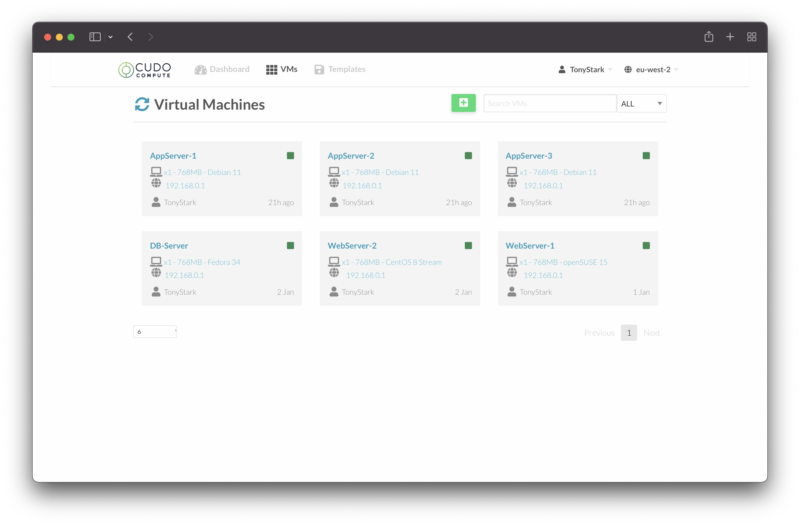
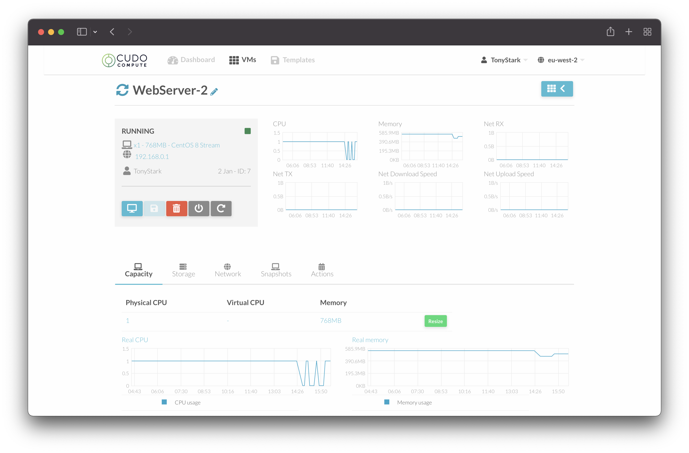

# Managing VMs

## View your VMs

Simply clicking on the "VMs" tab at the top of the page will allow you to view all of your existing virtual machines.

To get more details on one of your VMs, click in to the VM and you will be able to see all of the information such as performance metrics, IP address details, options to resize your VM and accessing a HTML5 web console to manage your server.

## Adding / Removing Resources