# Managing VMs

## View your VMs

Simply clicking on the "VMs" tab at the top of the page will allow you to view all of your existing virtual machines.


To get more details on one of your VMs, click in to the VM and you will be able to see all of the information such as performance metrics, IP address details, options to resize your VM and accessing a HTML5 web console to manage your server.


## VM Management

### VNC Console

You will be able to open a remote console on any VM that you create on the Cudo Compute platform. On any running VM, simply click the blue "Console" button and select "VNC".

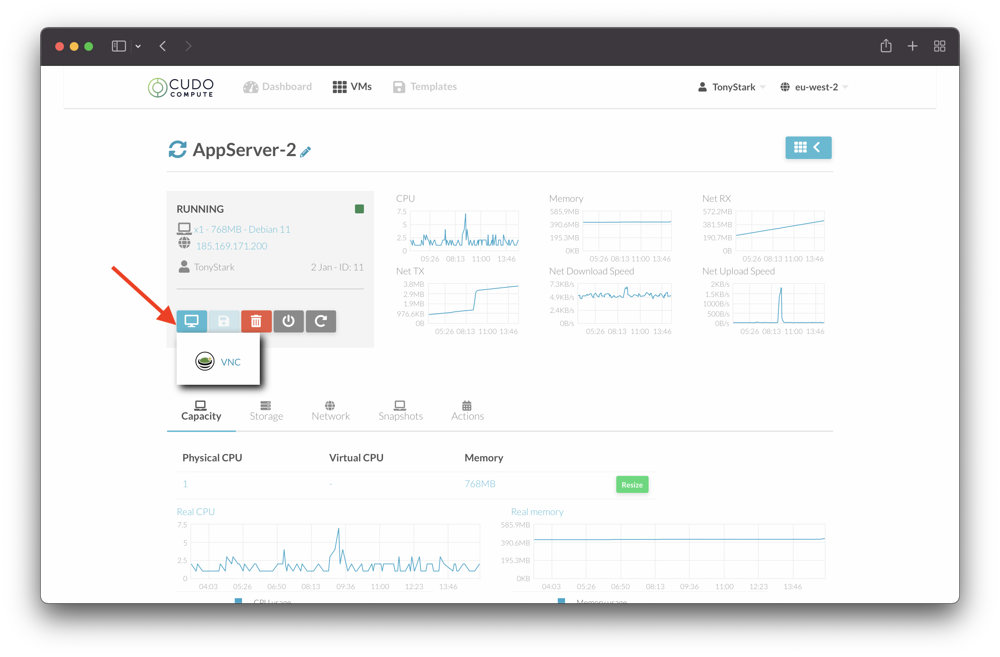

This will open a popup with the console where you will be able to login to your VM.

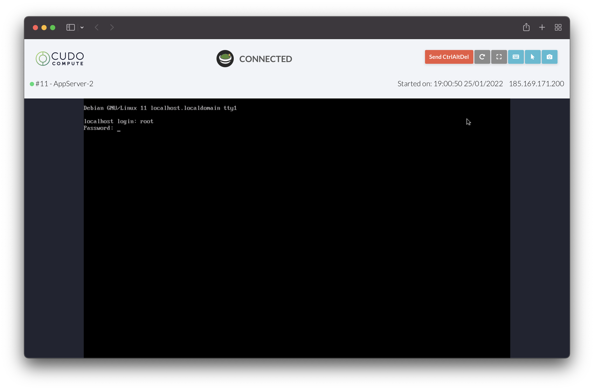

Within the VM console, you will have the ability to restart, open a virtual keyboard, take screenshots and other tools as well.

### Reboot VM

Click on the grey 'reboot' button to send a reboot signal to the virtual machine. Check the [VNC Console](managing-vms.md#vnc-console) to see the status of the VM while rebooting.

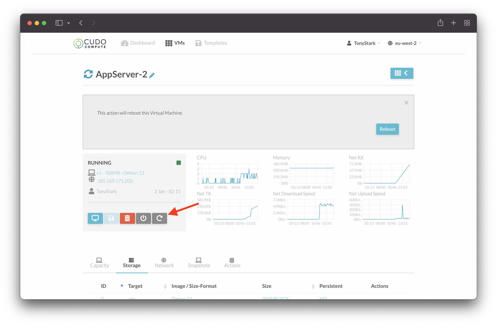

### Power Off VM

Click on the grey 'power off' button to power off the virtual machine.

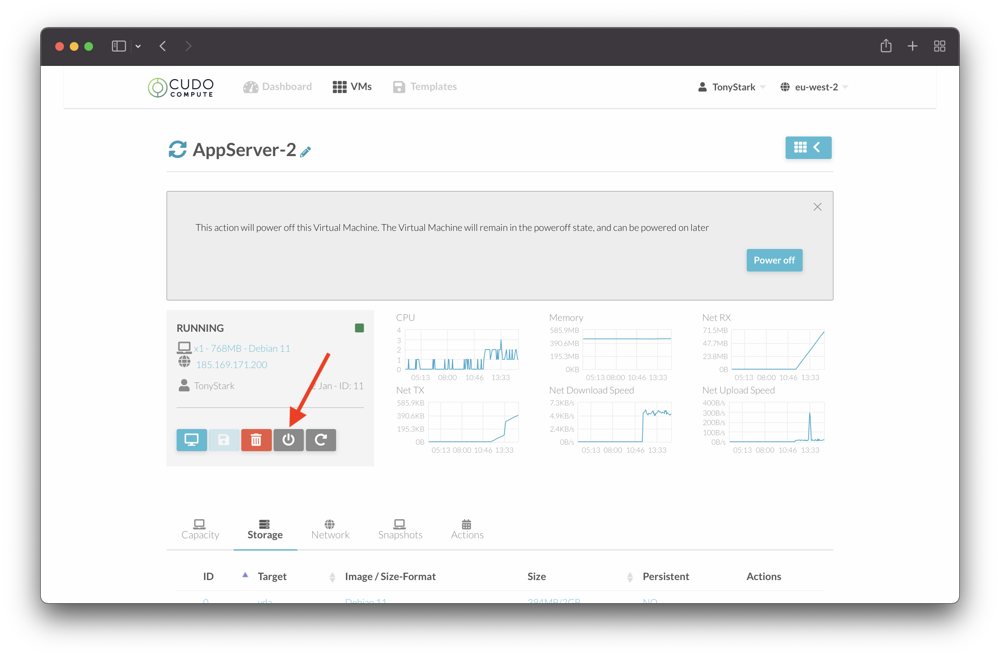

### Power On VM

If your VM is powered off, you will see a grey "start" button. Simply click this to power your VM on.

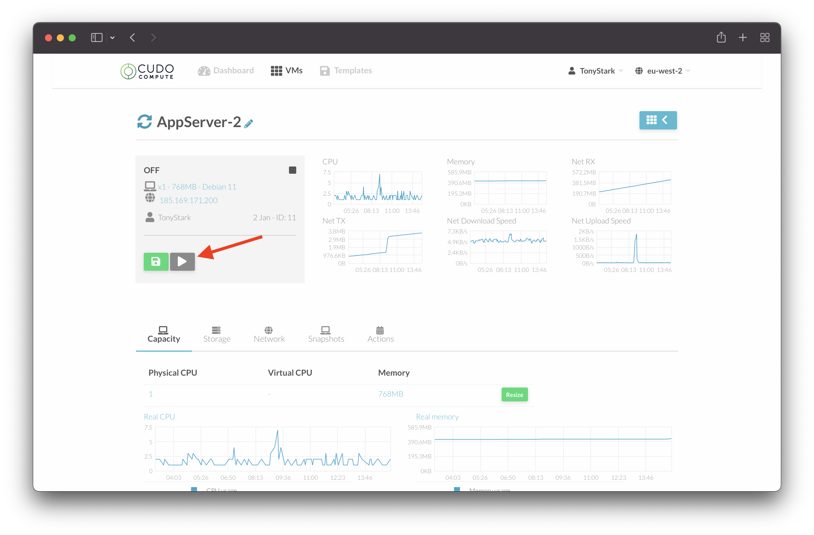

### Destroy VM

Click on the red 'destroy' button to destroy the virtual machine.

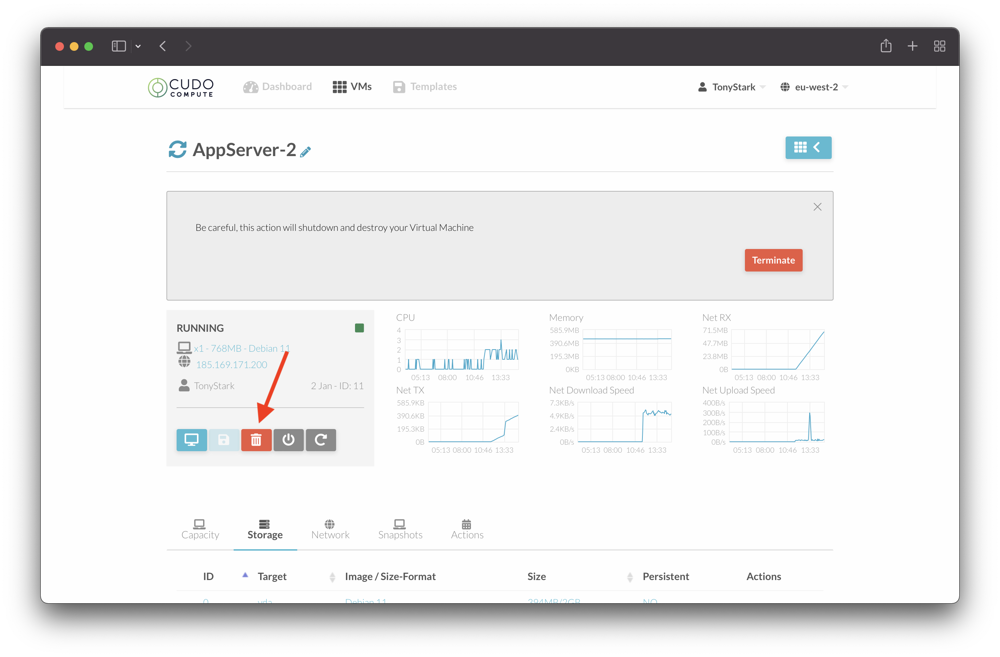

::: danger
Once the VM has been destroyed, it will not be possible to recover it. Please only destroy your VM if you are sure.
:::

### Save-as Template

You can use the Cudo Compute interface to save your existing VM as a template, so you can redeploy it multiple times. Firstly, you need to ensure the VM is [powered off](managing-vms.md#power-off-vm) before you have this option available.

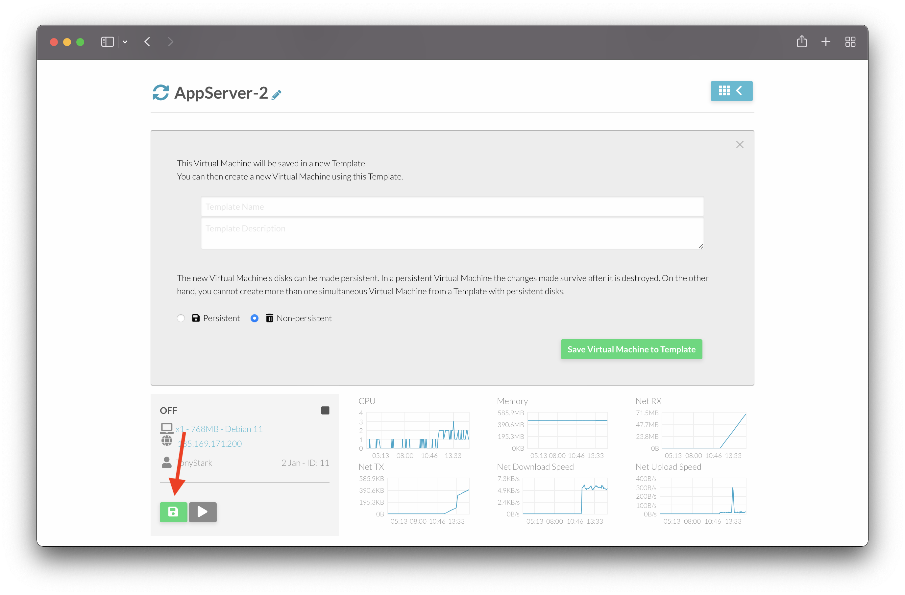

Clicking the green 'disk' icon will allow you to save this VM as a template. Simply select if you want it to be persistent or non-persistent and then click 'Save Virtual Machine to Template'. After a few minutes, this template will now be selectable for you when you [build a VM](building-vms.md).

## Resource Management

### CPU / RAM

You can change the CPU or RAM assigned to your VM by browing to the "Capacity" tab on the VM summary page. Here you can see the currently assigned CPU & RAM resources.

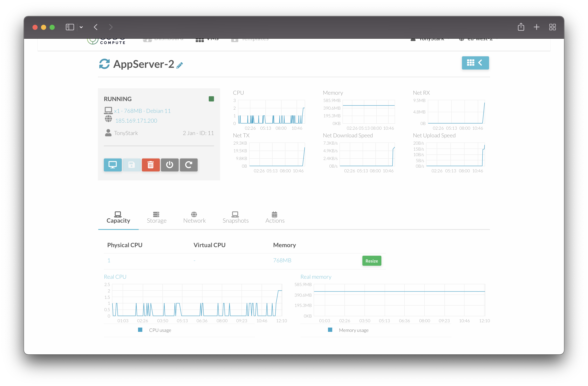

If you want to upgrade, or downgrade, resources assigned to this VM, simply click the green "Resize" button and a popup will appear where you can enter the new values.

::: tip NOTE
Please note that any values you increase must also adhere to the Quota you can see on the [Dashboard](./#dashboard) page. Please reach out to the [Support](./#support) team if you have any questions related to this.
:::

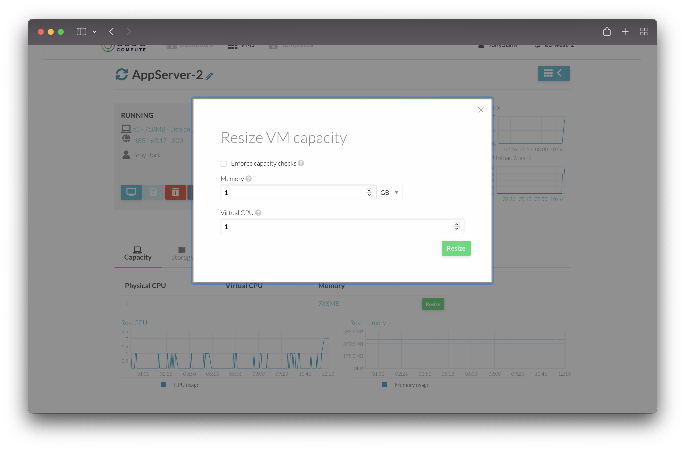

### Storage

You can view your storage details by clicking on the "Storage" tab on the VM summary page.

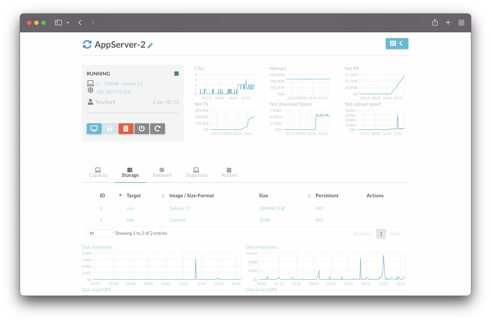

::: tip NOTE
Unfortunately, it is not currently possible to resize disks via this portal. Please reach out to the [Support](./#support) team if you have any questions related to this.
:::

### Networks

You can view details on the NIC inside your VM as well, from the "Network" tab on the VM summary page. Here you can retrieve usage statistics, IP address information and the MAC address of the interface.


## Snapshots

You can take and manage snapshots of your VMs by clicking on the "Snapshots" tab on the VM summary page.

Simply click the green "Take Snaphot" button to immediately take a snapshot of your VM.

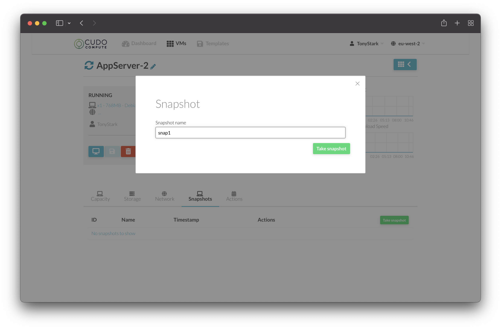

After a few moments, you will see the snapshot in the list and you will be able to either remove the snapshot entirely, or revert the VMs state back to that of the snapshot by clicking the appropiate buttons.

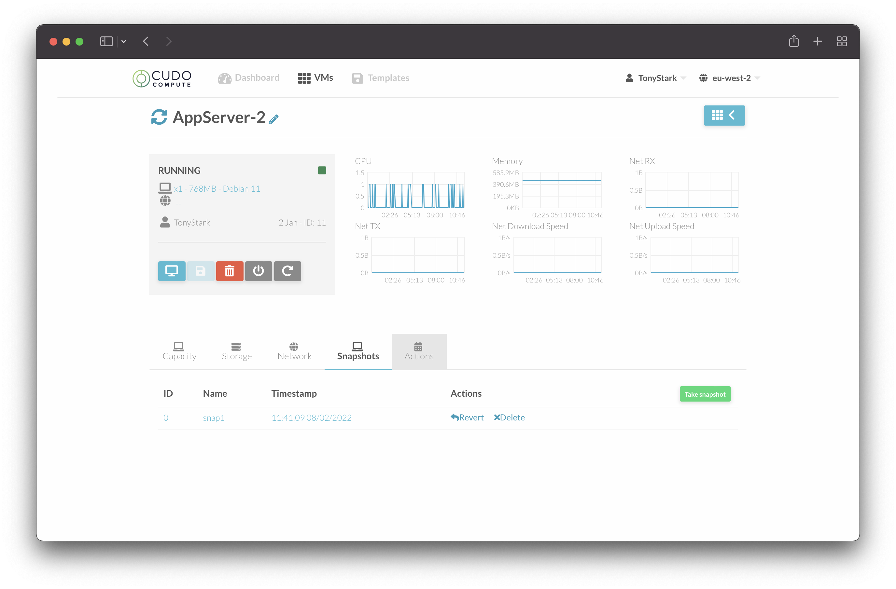

## Scheduled Tasks

By clicking on the "Actions" tab on the VM summary page, you can assign scheduled actions to the VM. This allows you to schedule tasks to run on a specific date/time, or even relative to the current time/date (eg. in 3 days from now). Some of the example actions could be to automatically terminate a VM after it has been running for 7 days. 

You can also configure Scheduled Tasks to run periodically - for example, if you wanted to reboot your VM at a specific time every weekend.

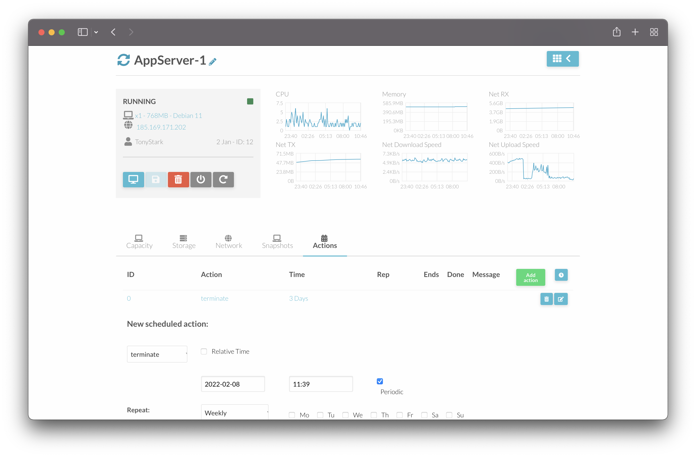

Please refer to the table below for a list of all available Scheduled Tasks

| Name | Details |
|--- |--- |
| terminate | Destroy the VM at the specified time. |
| resume | Power on the VM at the specified time (if powered off).  |
| reboot | Reboot the VM at the specified time (if powered on)  |
| poweroff | Power off the VM at the specified time (if powered on). |
| snapshot-create | Create a VM snapshot, with the name of your choice, at the specified time.  |
| snapshot-delete | Delete the VM snapshot, passing it the Snapshot ID, at the specified time.  |
| snapshot-revert | Revert the VM from the Snapshot ID that you want, at the specified time.  |

## Changing Password

Please note, if you wish to change the root password of your VM after it has been deployed, it is important to run the following command before you next reboot the VM.

``` shell
rm /etc/one-context.d/loc-20-set-username-password
```