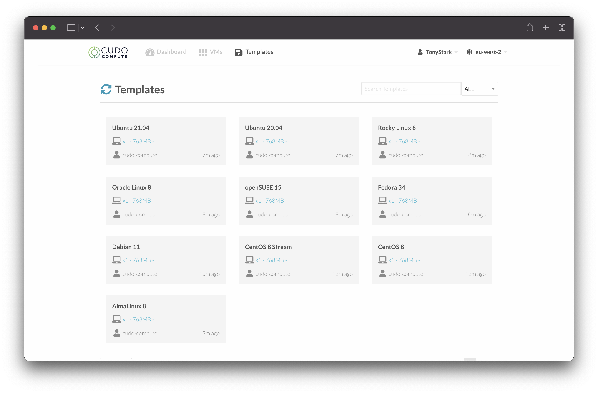

# Templates

## Available Templates

The initial release of the Cudo Compute platform will have small subset of templates available to build virtual machines from. We are open to suggestions on additional templates, so please reach out if you are looking for a template that is not currently available. The initial templates will be as follows:

| | Template Name | File Size |
|--- |---	|--- |
|  | AlmaLinux 8 | 4GB |
|  | CentOS 8 | 10GB |
|  | CentOS 8 Stream | 10GB |
|  | Debian 11 | 2GB |
|  | Fedora 34 | 5GB |
|  | openSUSE 15 | 1GB |
|  | Oracle Linux 8 | 37GB |
|  | Rocky Linux 8 | 4GB |
|  | Ubuntu 20.04 | 2.2GB |
|  | Ubuntu 21.04 | 2.2GB |

## Viewing Templates

You can view all available templates in the Cudo Compute user interface as well, by clicking the "Templates" tab at the top of the page.

